# SiteWatch AI 🛰️

**Earth intelligence you can trust.** Satellite change detection and
environmental monitoring where **every alert carries a statistical confidence
score** — built on Sentinel-2 optical + Sentinel-1 radar and an AI analyst
grounded in verified numbers.

## Why SiteWatch AI

Satellite monitoring has a trust problem: seasonal changes trigger false
alarms, clouds blind optical sensors, and most analytics ship without any
accuracy evidence. SiteWatch AI 2.0 solves all three:

| Problem | Our answer |
|---|---|
| 🍂 Seasonal false positives | Per-pixel harmonic baselines — phenology is *expected*, not alerted |
| ☁️ Cloud blindness | Sentinel-1 SAR corroboration, works through cloud & darkness |
| 🎲 Unvalidated analytics | Error matrix, kappa & per-class accuracy published with every map |
| 📊 Data ≠ decisions | AI analyst answers in plain language, grounded in verified facts |
| 🚨 Alert overload | Calibrated 0–1 confidence score + evidence trail on every alert |

Full methodology (with literature citations): [`docs/WHITEPAPER.md`](docs/WHITEPAPER.md)

**New in 2.0:** a real, cross-validated ML land-cover classifier, a
book-grounded RAG analyst with page-level citations, and an agentic reasoning
loop — see [`docs/ML_AND_AGENT_v2.md`](docs/ML_AND_AGENT_v2.md) with verified
results (overall accuracy 0.882, kappa 0.869).

**New in 2.1 — shipped and verified live:** the table above is no longer a
promise; it runs in the production scan pipeline. Every scan now performs
Sentinel-1 SAR corroboration (median composites, ±3 dB log-ratio, radar water
extent) and seasonal alert triage against the site's own multi-year z-score
baseline, with SAR-adjusted calibrated confidence. Live run over Kochi, India
(monsoon conditions): optical change 18.8%, SAR change 16.5% from 6 radar
images — **radar independently confirmed the optical signal**, confidence
92.6%. See [`docs/ALL_WEATHER_MONITORING.md`](docs/ALL_WEATHER_MONITORING.md)
and [`docs/LIVE_VERIFICATION.md`](docs/LIVE_VERIFICATION.md), with real scan
imagery in [`docs/proof/`](docs/proof/).

### See it — real output from the live system

| Optical: true color (Apr → Jul, monsoon) | Radar: same site, cloud-immune |
|---|---|
| 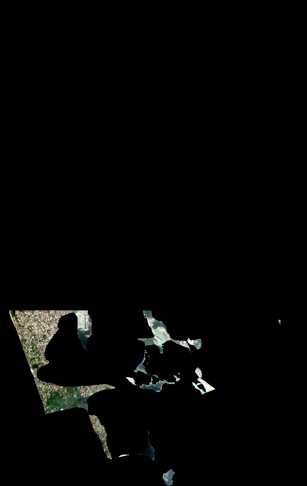 | 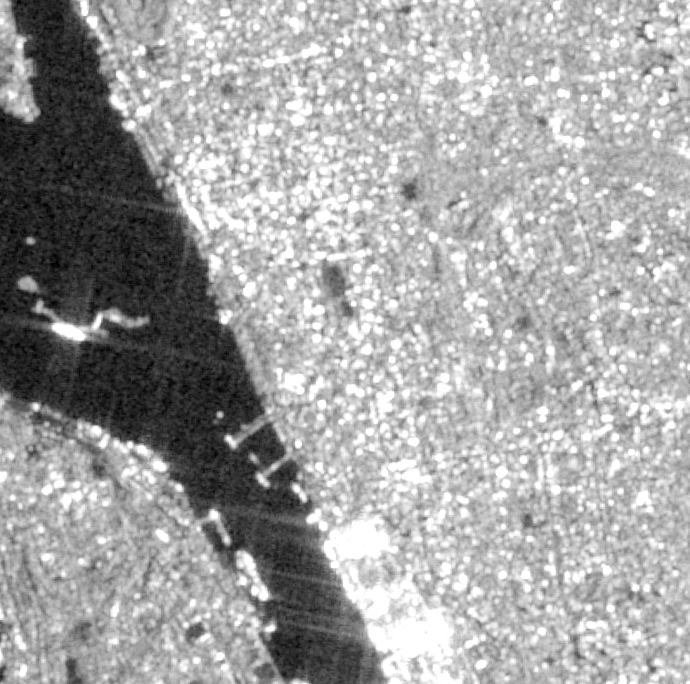 |
| 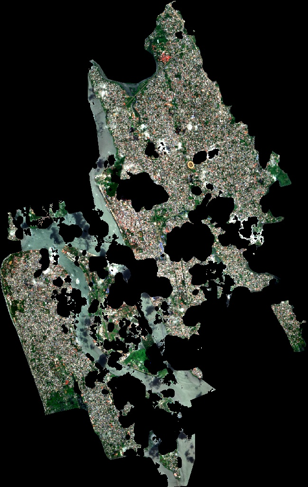 | 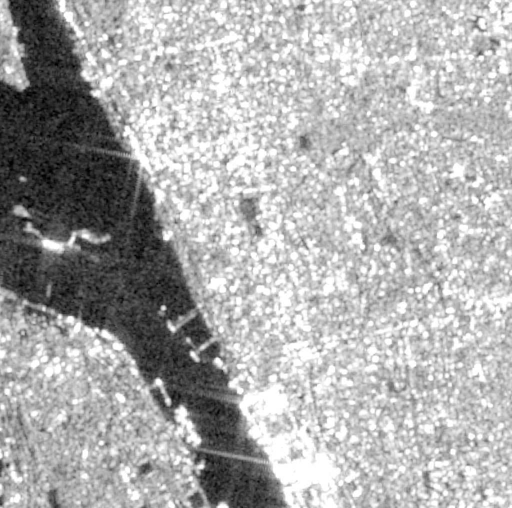 |

| NDVI change map | SAR log-ratio change | Water change hotspots |
|---|---|---|
| 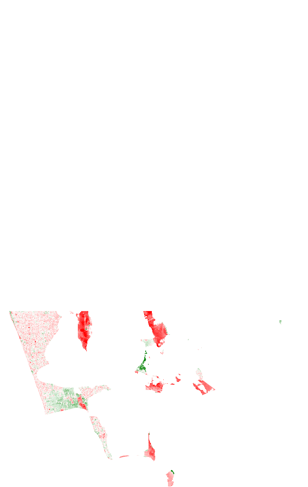 | 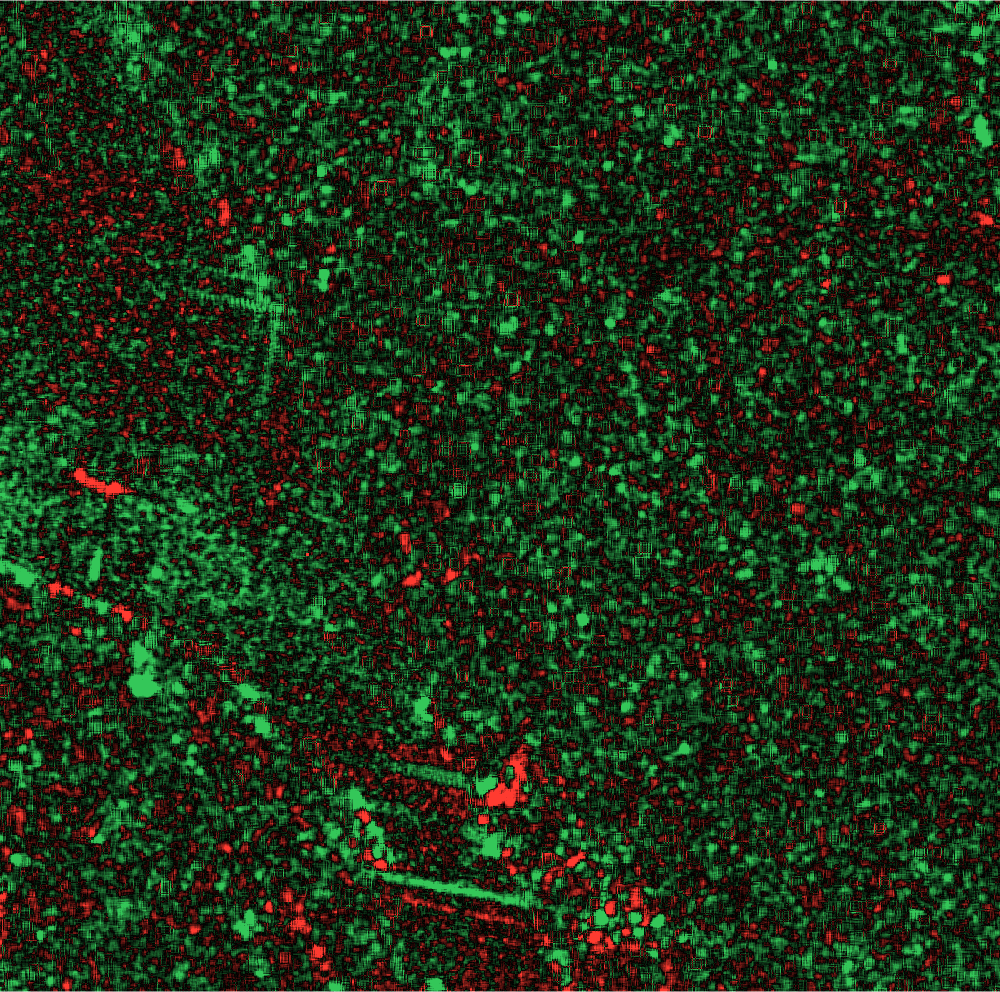 | 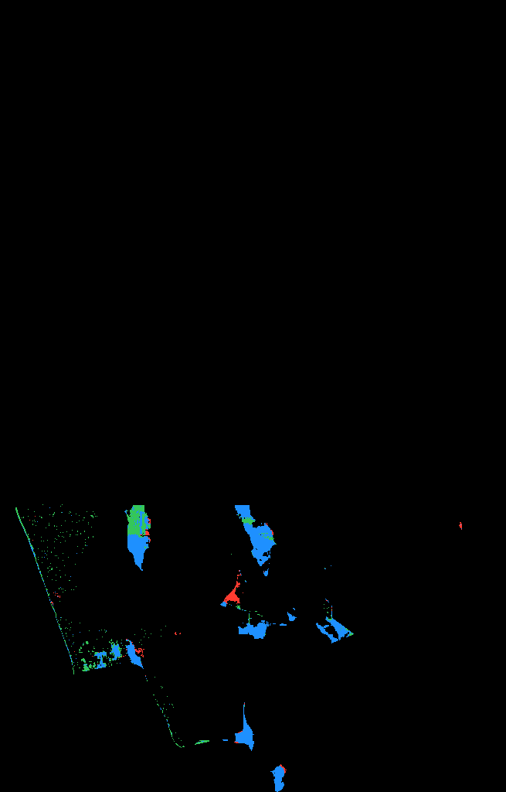 |

**ML classifier validation** (leakage-safe grouped CV):

| Confusion matrix | Classification map | Feature importance |
|---|---|---|
| 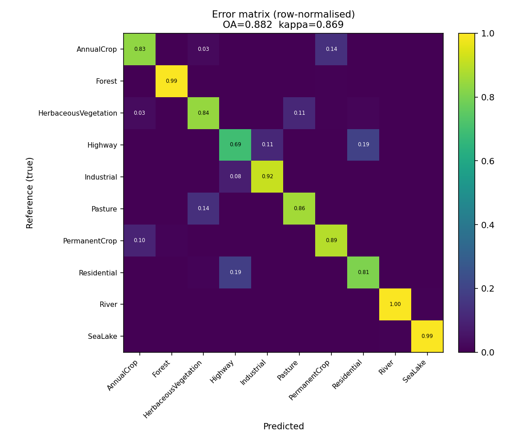 | 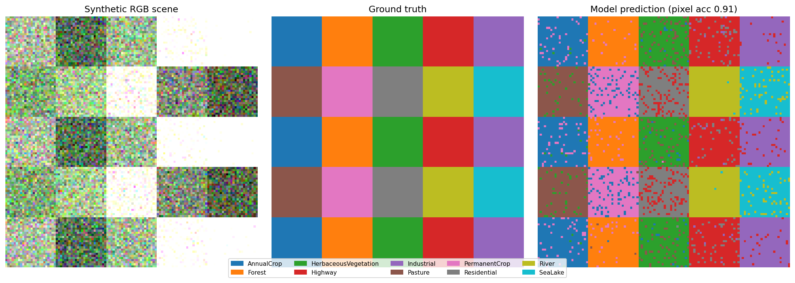 | 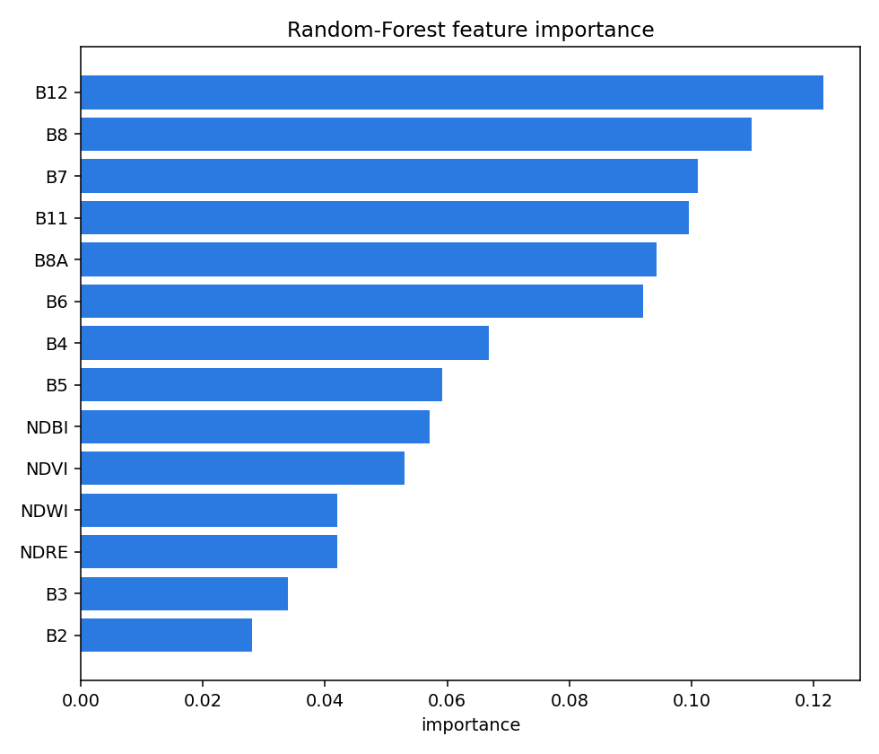 |

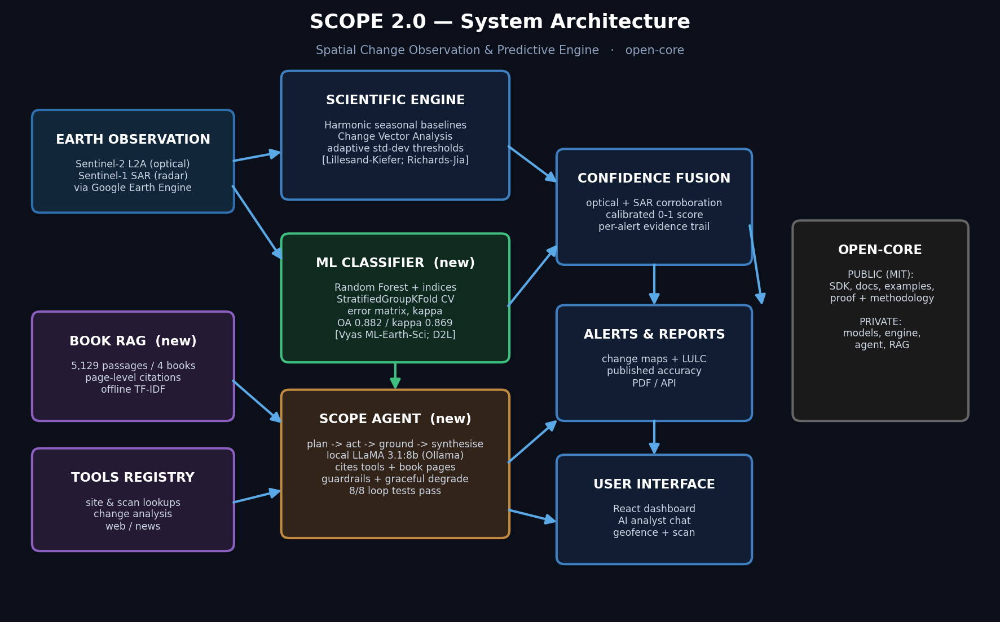

## Use it

```python
from sitewatch_client import SiteWatch

sw = SiteWatch("https://api.sitewatch.ai", token="YOUR_TOKEN")

result = sw.analyze_change(
    lat=12.7974, lon=80.2232,
    before=("2025-01-01", "2025-03-01"),
    after=("2026-01-01", "2026-03-01"),
)
print(result["change_label"])       # e.g. "construction"
print(result["confidence"])         # e.g. 0.93
print(result["sar"])                # radar corroboration evidence

# Ask the grounded AI analyst (cites the science books it used):
answer = sw.ask("Why was this flagged, and how is the confidence computed?")
print(answer["answer"], answer["citations"])
```

SDK: [`sdk/sitewatch_client.py`](sdk/sitewatch_client.py) (MIT licensed).

## Who it's for

Construction & infrastructure monitoring · ESG / deforestation compliance ·
insurance & risk · agriculture · government & NGOs — anyone who needs to know
*what changed on the ground, with how much certainty*.

## Architecture (high level)

```
Sentinel-2 L2A ─┐
                ├─► Scientific engine ─► Confidence fusion ─► Alerts + reports
Sentinel-1 SAR ─┘        │                                       │
                    harmonic baselines                    AI analyst (LLM,
                    CVA + adaptive thresholds             grounded in verified
                    RF land cover + accuracy              numeric facts)
```

The analytics engine is proprietary. This repository contains the public SDK,
methodology whitepaper, and examples.

## Contact

**Jissal Gigi** — jissalgigi@gmail.com · [jissalgigi website](https://jissalgigi.com)

---
© 2026 SiteWatch AI. SDK under MIT; platform and engine proprietary.
