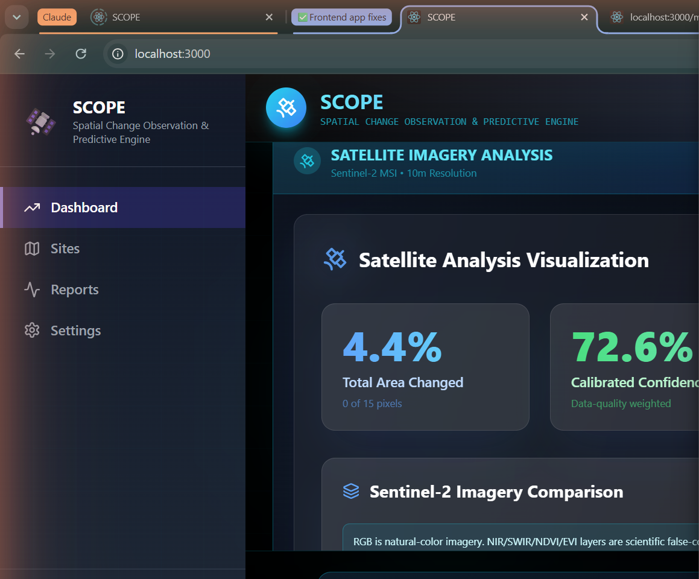
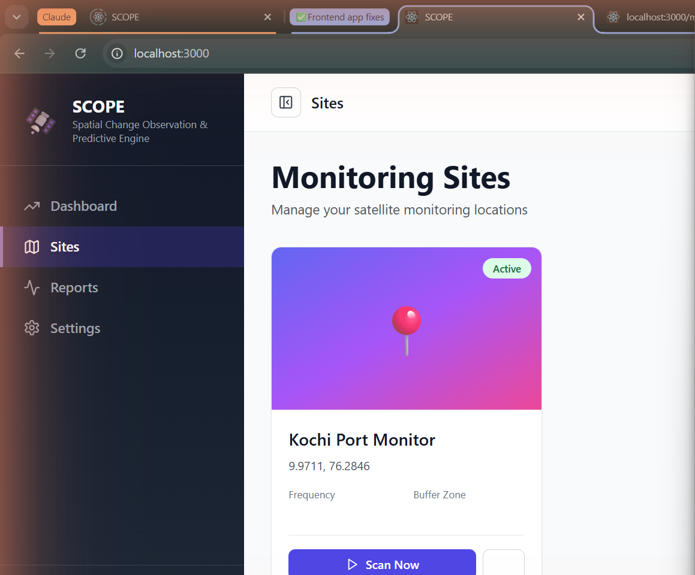

# SCOPE User Guide

Everything you can do in the app, and how the pieces fit together.



## 1. Getting in

Sign in at the **Welcome Back** screen. New accounts are created by the
administrator. Your chat history and analyses persist per account.

## 2. Talking to the AI (Command Interface)

The bottom bar on the Dashboard is a natural-language command line backed by a
local LLM (nothing leaves your machine). Things you can type:

| You type | What happens |
|---|---|
| `Analyze Kochi, India` | Full satellite scan of that location (geocoded automatically) |
| `Analyze 9.9711, 76.2846` | Same, by exact coordinates |
| Any question about the results | The AI answers grounded in the actual scan numbers |
| A domain question ("Which index detects floods under clouds?") | Reasoned answer with methodology |
| `Enable weekly email alerts for this site` | Sets up recurring monitoring + email reports |

While a scan runs you'll see a **live pipeline tracker**: elapsed clock,
progress bar, and six stages (image selection → spectral indices → SAR radar →
seasonal baseline → imagery products → evidence fusion).

**Ask follow-ups.** The AI keeps the scan in context — e.g. *"The radar says
water decreased but NDWI says wetter — which should I trust?"* gets an answer
citing the actual SAR log-ratio and NDWI values from your scan.

## 3. Reading a result

- **Total Area Changed** — % of pixels flagged by multi-index agreement.
- **Calibrated Confidence** — data-quality weighted (cloud %, temporal gap,
  season match) and adjusted by independent radar corroboration. One decimal,
  honest bands (high/medium/low).
- **Alert triage banner** — 🟢 quiet · 🟡 seasonal-normal (suppressed) ·
  🟠 low-trust / watch · 🔴 anomaly alert. Changes only escalate when
  statistically anomalous vs. the site's own multi-year seasonal baseline AND
  not contradicted by radar.
- **Imagery sections** — true color, NIR (vegetation), SWIR (moisture), water
  masks + gain/loss, NDVI change, binary change mask, and the **all-weather
  SAR radar** section (baseline/current backscatter + ±3 dB change map).
- **Export Report** — downloads the full structured report.

**Small areas:** if your geofence is under ~0.5 km², the app warns you that
per-pixel statistics are unreliable and renders imagery with ~3 km of
surrounding context so the scene stays recognizable.

## 4. Monitoring Sites (geofencing)



**Sites → Add Site**: name it, search an address (the resolver fills
coordinates and a GeoJSON boundary), or click the map / paste your own
polygon. Set a buffer (km) and scan frequency (e.g. weekly).

- **Scan Now** runs the full pipeline on the site immediately.
- **Grid / Map** toggles card view vs. world map of all your sites.
- Sites with `auto alert` enabled email you when change exceeds your
  threshold — with the PDF report attached.

## 5. Focus mode & layout

- **Top-left panel button** (next to the page title) hides the navigation
  sidebar so you can concentrate on the chat and results.
- **Focus Chat** expands the conversation.
- **Hide System** collapses the satellite status column.

## 6. Email alerts

Set in `.env` (Gmail: use an App Password):

```
SMTP_USER=you@gmail.com
SMTP_PASSWORD=your-app-password
EMAIL_PROVIDER=smtp
```

Then enable `auto alert` on a site (or tell the AI "enable weekly email
alerts"). When a scan crosses the site's change threshold, the report is
emailed automatically.

## 7. Under the hood

Sentinel-2 optical (10 m) + Sentinel-1 radar (cloud-immune) via Google Earth
Engine; statistical methodology from Lillesand & Kiefer and Richards & Jia;
local LLaMA via Ollama for the analyst. See
[`ALL_WEATHER_MONITORING.md`](ALL_WEATHER_MONITORING.md) and
[`WHITEPAPER.md`](WHITEPAPER.md).
